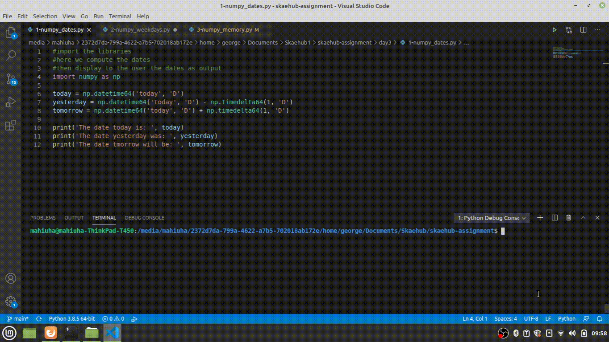
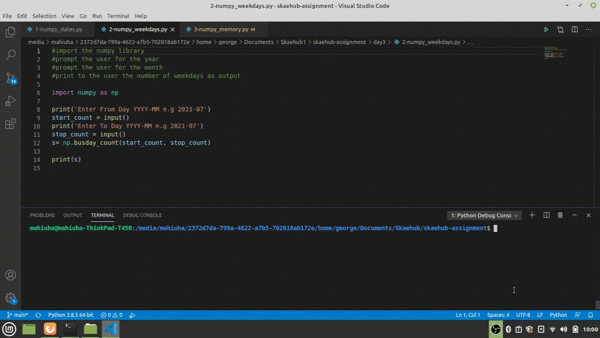
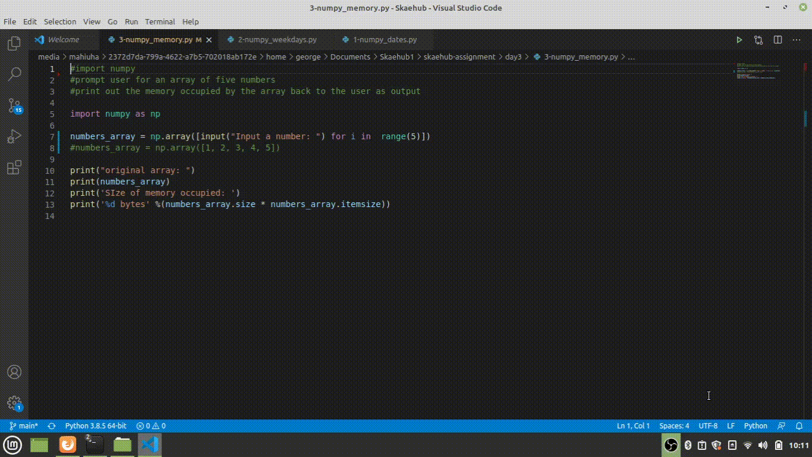

# Each python scripts and their output


**Script 1-numpy_dates.py** 

*Question1*

```Write a NumPy program to get the dates of yesterday, today and tomorrow```



**Script 2-numpy_weekdays.py**

*Question2*

```Write a NumPy program to find the number of weekdays in a given month. Allow the user to input the month and year of their choice```



**Script 3-numpy_memory.py**

*Question3*

```Write a NumPy program to create an array with at least 5 user input integers and determine the size of the memory occupied by the array```




